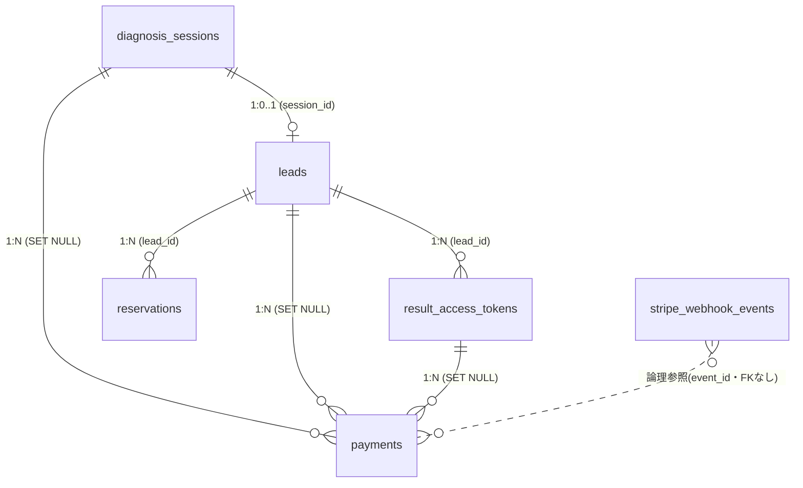

# 資産形成診断アプリ DB仕様書

出典：`backend/database/xs899439_nohoke.sql` および各モデル（`backend/src/Models/*`）・マイグレーション。
`children_count` 化（`2026_07_02`）／`result_access_tokens.expires_at` NULL 許容（`2026_06_26`）を反映済み。
全テーブル `ENGINE=InnoDB / DEFAULT CHARSET=utf8mb4 / COLLATE=utf8mb4_unicode_ci`。

> 本ドキュメントは「現状の実装」を記述したものです。保持期間ポリシーや削除フローの
> あるべき姿は「4. 注意点・ギャップ」を参照してください。

---

## 1. ER図



削除伝播（重要）：

```
diagnosis_sessions ──CASCADE──> leads ──CASCADE──> result_access_tokens
                                     └─CASCADE──> reservations
payments.diagnosis_session_id / lead_id / result_access_token_id は ON DELETE SET NULL
（＝親を消しても payments 行は残り、payments.email も残る）
stripe_webhook_events は独立（FKなし）
```

---

## 2. カラム定義

### 2-1. `diagnosis_sessions`（匿名の診断入力・スコア）

| カラム | 型 | NULL | 既定 | 説明 |
|---|---|---|---|---|
| id | BIGINT UNSIGNED AI | No | | PK |
| session_id | VARCHAR(255) UNIQUE | No | | 診断セッションID（UUID） |
| age | INT UNSIGNED | Yes | | 年齢 |
| children_count | TINYINT UNSIGNED | Yes | | 未成年の扶養人数 |
| monthly_income | DECIMAL(10,2) | Yes | | 手取り月収 |
| monthly_fixed_cost | DECIMAL(10,2) | Yes | | 毎月固定費 |
| savings | DECIMAL(12,2) | Yes | | 現預金額 |
| monthly_insurance | DECIMAL(10,2) | Yes | | 毎月保険料 |
| diagnosis_score | INT UNSIGNED | Yes | | 診断スコア |
| created_at | TIMESTAMP | | CURRENT_TIMESTAMP | 作成 |
| updated_at | TIMESTAMP | | CURRENT_TIMESTAMP ON UPDATE | 更新 |

索引：`idx_session_id (session_id)`, `idx_created_at (created_at)`

### 2-2. `leads`（メール登録ユーザー）

| カラム | 型 | NULL | 既定 | 説明 |
|---|---|---|---|---|
| id | BIGINT UNSIGNED AI | No | | PK |
| diagnosis_session_id | BIGINT UNSIGNED UNIQUE | Yes | | → diagnosis_sessions.id（**ON DELETE CASCADE**） |
| email | VARCHAR(255) | No | | **メールアドレス（個人情報）** |
| is_email_verified | BOOLEAN | | FALSE | メール認証済みフラグ |
| created_at | TIMESTAMP | | CURRENT_TIMESTAMP | 作成 |
| updated_at | TIMESTAMP | | CURRENT_TIMESTAMP ON UPDATE | 更新 |

索引：`idx_email (email)`, `idx_created_at (created_at)`

### 2-3. `result_access_tokens`（結果閲覧URLトークン）

| カラム | 型 | NULL | 既定 | 説明 |
|---|---|---|---|---|
| id | BIGINT UNSIGNED AI | No | | PK |
| lead_id | BIGINT UNSIGNED | No | | → leads.id（**ON DELETE CASCADE**） |
| token | VARCHAR(255) UNIQUE | No | | アクセストークン（`random_bytes(32)` の64桁hex） |
| expires_at | TIMESTAMP | Yes | | **NULL=無期限（500円購入者）／ 日時=有効期限（無料は発行から7日）** |
| accessed_at | TIMESTAMP | Yes | | 最終アクセス日時 |
| created_at | TIMESTAMP | | CURRENT_TIMESTAMP | 作成（**updated_at なし**） |

索引：`idx_token (token)`, `idx_lead_id (lead_id)`, `idx_expires_at (expires_at)`

有効判定：`ResultAccessToken::isValid()` は `expires_at === null || expires_at > now()`。

### 2-4. `payments`（Stripe決済）

| カラム | 型 | NULL | 既定 | 説明 |
|---|---|---|---|---|
| id | BIGINT UNSIGNED AI | No | | PK |
| diagnosis_session_id | BIGINT UNSIGNED | Yes | | → diagnosis_sessions.id（**ON DELETE SET NULL**） |
| lead_id | BIGINT UNSIGNED | Yes | | → leads.id（**ON DELETE SET NULL**） |
| email | VARCHAR(255) | Yes | | **購入者メール／receipt_email（個人情報）** |
| plan_code | VARCHAR(50) | No | 'basic_500' | プランコード |
| amount | INT UNSIGNED | No | | 金額（JPYはゼロ小数通貨のため 500 をそのまま） |
| currency | CHAR(3) | No | 'jpy' | 通貨 |
| status | ENUM(pending/paid/failed/canceled/refunded) | No | 'pending' | 決済ステータス |
| stripe_payment_intent_id | VARCHAR(255) UNIQUE | Yes | | pi_…（ポーリング／冪等キー） |
| stripe_charge_id | VARCHAR(255) | Yes | | 返金照合用 |
| stripe_customer_id | VARCHAR(255) | Yes | | Stripe顧客ID |
| paid_at | TIMESTAMP | Yes | | 入金確定日時 |
| email_sent_at | TIMESTAMP | Yes | | 完了メール送信日時（二重送信防止） |
| result_access_token_id | BIGINT UNSIGNED | Yes | | → result_access_tokens.id（**ON DELETE SET NULL**） |
| metadata | JSON | Yes | | 監査・拡張用（**内容次第で個人情報を含みうる**） |
| created_at | TIMESTAMP | | CURRENT_TIMESTAMP | 作成 |
| updated_at | TIMESTAMP | | CURRENT_TIMESTAMP ON UPDATE | 更新 |

索引：`idx_payment_intent (stripe_payment_intent_id)`, `idx_status (status)`, `idx_email (email)`, `idx_diagnosis_session_id (diagnosis_session_id)`

### 2-5. `stripe_webhook_events`（Webhook冪等管理）

| カラム | 型 | NULL | 既定 | 説明 |
|---|---|---|---|---|
| id | BIGINT UNSIGNED AI | No | | PK |
| event_id | VARCHAR(255) UNIQUE | No | | evt_…（二重配信を無視するための冪等キー） |
| type | VARCHAR(100) | No | | イベント種別 |
| payload | LONGTEXT | Yes | | 受信ペイロード（**Stripe側の email/receipt_email 等を含みうる**） |
| processed_at | TIMESTAMP | Yes | | 処理完了日時 |
| created_at | TIMESTAMP | | CURRENT_TIMESTAMP | 作成 |

索引：`idx_event_id (event_id)`, `idx_type (type)`（FKなし・独立テーブル）

### 2-6. `reservations`（TimeRex予約連携）

| カラム | 型 | NULL | 既定 | 説明 |
|---|---|---|---|---|
| id | BIGINT UNSIGNED AI | No | | PK |
| lead_id | BIGINT UNSIGNED | No | | → leads.id（**ON DELETE CASCADE**） |
| timerex_reservation_id | VARCHAR(255) | Yes | | TimeRex予約ID |
| reservation_status | ENUM(pending/confirmed/cancelled) | | 'pending' | 予約ステータス |
| reserved_at | TIMESTAMP | Yes | | 予約日時 |
| created_at | TIMESTAMP | | CURRENT_TIMESTAMP | 作成 |
| updated_at | TIMESTAMP | | CURRENT_TIMESTAMP ON UPDATE | 更新 |

索引：`idx_lead_id (lead_id)`, `idx_timerex_reservation_id (timerex_reservation_id)`, `idx_reservation_status (reservation_status)`

---

## 3. 個人情報の保持・削除仕様（現状の実装）

### 3-1. 個人情報の所在

| 種別 | 保存先 | 備考 |
|---|---|---|
| メールアドレス | `leads.email`, `payments.email` | 直接識別子 |
| メール（外部） | Stripe（receipt_email）, `stripe_webhook_events.payload` | Stripe側にも保持される |
| メール（外部） | Google スプレッドシート `hohoke_user_log` | `SheetLogService` が email+session_id+score+grade を GAS 経由で POST |
| メール（ログ） | アプリログ | `RegisterLeadAction` が `logger->info('Lead registered', ['email'=>…])` で記録 |
| 財務・属性データ | `diagnosis_sessions`（年齢・扶養人数・収入・固定費・預金・保険料） | 単体では匿名。`leads` 経由でメールと紐付くと個人と結合可能 |
| 認証情報 | `result_access_tokens.token` | メールURLの実質パスワード相当 |

### 3-2. 保持期間

- **無料プラン**：`result_access_tokens.expires_at = 発行から7日`（`RegisterLeadAction`：`Carbon::now()->addDays(7)`）。
  ただしこれは**トークンの閲覧可否のみ**を無効化する仕組み（`ResultAccessToken::isValid()`）。
  **`leads`・`diagnosis_sessions` などの本体データ・メールアドレスは削除されず無期限に残存**する。
- **500円プラン**：`expires_at = NULL`（無期限。`PaymentFulfillmentService`）。
- **結論：現状、個人情報の実質的な保持期間は「無期限」**。自動削除・匿名化のバッチ／cron は未実装
  （コード内に purge/cleanup 処理なし）。

### 3-3. 削除の仕組み

- **自動削除：なし**（保持期限切れデータの物理削除・匿名化ジョブは未実装）。
- **手動削除時のFK伝播**：
  - `diagnosis_sessions` を削除 → `leads` が CASCADE → その `result_access_tokens`・`reservations` も CASCADE。
  - `leads` を削除 → `result_access_tokens`・`reservations` が CASCADE。
  - ただし **`payments` は SET NULL**（親を消しても決済行と `payments.email` は残る）。
  - `stripe_webhook_events` は独立で残る。
- **ユーザー起点の削除／オプトアウトAPI：なし**。
- **外部（Google Sheet／Stripe／SMTP送信先）に渡ったメールは、DBを消しても残る**（別途手動対応が必要）。

---

## 4. 注意点・ギャップ（要検討）

1. **保持期間ポリシーが未定義**：7日はトークン失効のみでデータは残り続ける。
   → 保持上限（例：90日）を決め、期限切れ `diagnosis_sessions`／`leads` を削除 or 匿名化する定期ジョブが必要。
2. **`payments` が SET NULL** のため、親削除後も `email` が孤立して残る。完全削除フローを別途設計する必要あり。
3. **メールがアプリログ・外部スプレッドシートに複製**されている。
   削除要求（開示・消去）対応時は DB＋ログ＋Sheet＋Stripe の4系統を対象にする必要あり。
4. **削除／開示請求の受付導線が無い**（個人情報保護法対応を見据えるなら要追加）。

---

_最終更新：2026-07-03_
